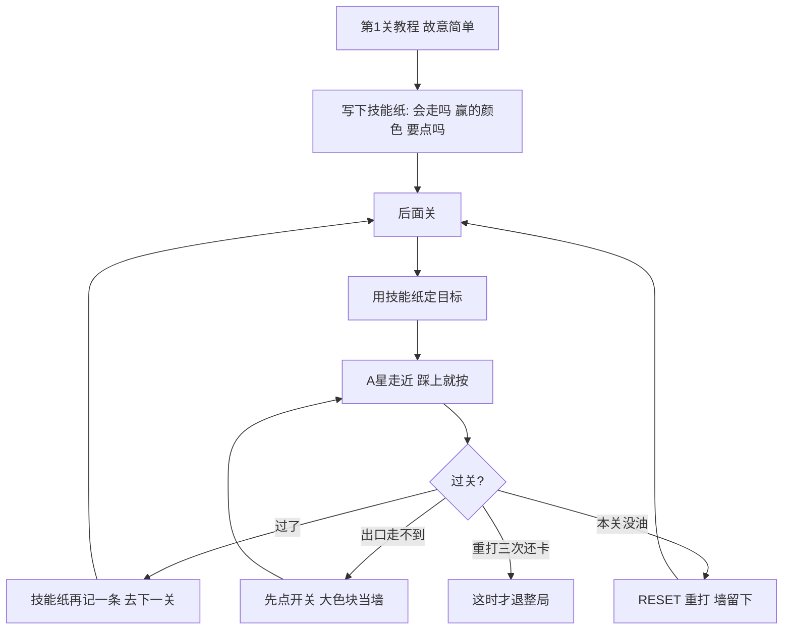

# 参赛方案：对着官方赛题设计的，不是对着公开本抄的

官方技术报告把 ARC-AGI-3 定义成四件事：**探索、建模、自己定目标、规划执行**。
没有说明书。至少 6 关。第 1 关是教程，故意简单，用来教会核心交互。
后面关要 **组合前面学会的机制**。整局分是关卡号加权，没打完后面关会封顶：

- 5 关只打完前 3 关，封顶 6/15 = 40%，前 3 关再快也抬不上去
- 人 10 步你 100 步，单关只剩 0.01

公开哈希图探索器每关把地图清空，等于把官方「教程关是给后面关用的」丢掉了。

## 我们的打法

1. **教程关收割技能纸**：哪些键会平移角色、点哪些颜色会变、踩上按一下会不会过关。记下多个赢的颜色，以及「点了会变」的颜色。
2. **自己定目标**：优先追上一关赢过的颜色；只追小块；A* 走不到就换下一个候选，不要死磕地板。
3. **规划**：在已知墙里 A* 走近目标，最后一步踩上后立刻 ACTION5。
4. **组合关**：出口颜色还在但 A* 走不到时，先点小开关（不要先去摸旁边的小色块，也不要点出口本身）。大色块在规划里当墙，避免在门上空转。
5. **走路彻底没用再点**。图穷了或重打本关后才问 Gemma（模型内部思考不计步）。
6. **后面关多给步数**：有可达猎点时不要 700 步一刀切。硬上限先 RESET 重打本关（已知墙还在），不要直接退整局。整局 `MAX_ACTIONS = 8000`。

不按游戏名写死。hidden 集和公开集机制刻意不重叠。

## 线上结果（2026-08-14）

Submit to Competition 提交 `55511330`（kernel v10）公开榜 **0.17**（此前 explorer 0.06）。
大约 50 分钟 COMPLETE，不像跑满 8 小时。更像教程关能过、后面加权关被封顶。
换环境先读 [HANDOFF.md](HANDOFF.md)。

