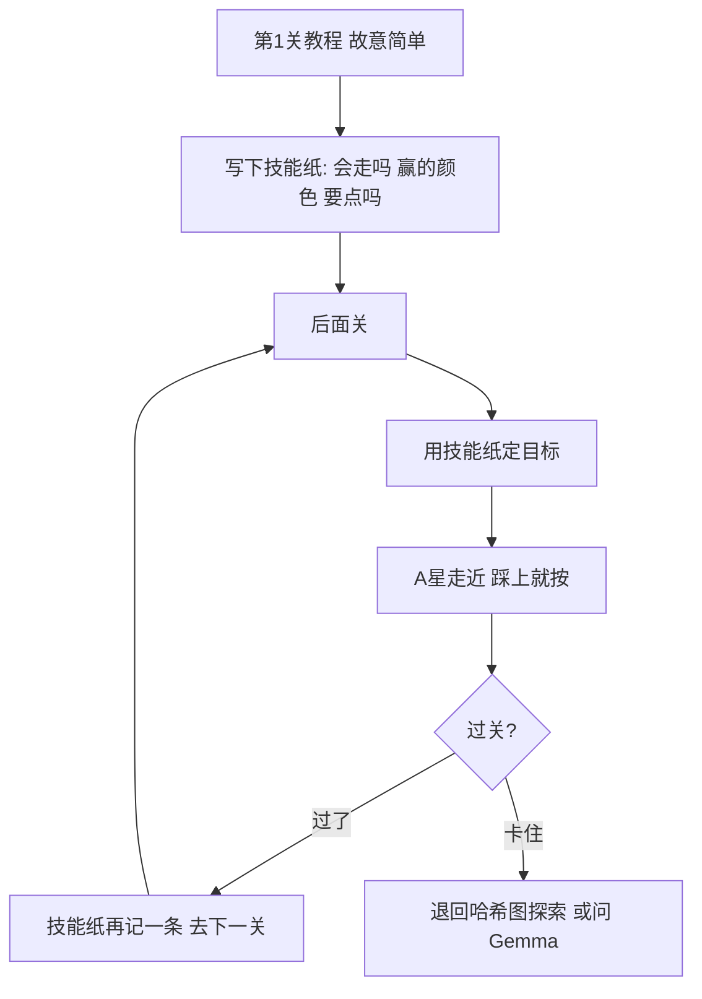

# 参赛方案：对着官方赛题设计的，不是对着公开本抄的

官方技术报告把 ARC-AGI-3 定义成四件事：**探索、建模、自己定目标、规划执行**。
没有说明书。至少 6 关。第 1 关是教程，故意简单，用来教会核心交互。
后面关要 **组合前面学会的机制**。整局分是关卡号加权，没打完后面关会封顶：

- 5 关只打完前 3 关，封顶 6/15 = 40%，前 3 关再快也抬不上去
- 人 10 步你 100 步，单关只剩 0.01

公开哈希图探索器每关把地图清空，等于把官方「教程关是给后面关用的」丢掉了。

## 我们的打法

1. **教程关收割技能纸**：哪些键会平移角色、点哪些颜色会变、踩上按一下会不会过关。
2. **自己定目标**：优先追上一关赢过的颜色；否则追小而稀有的块（像出口/开关）。
3. **规划**：在已知墙里 A* 走一步靠近目标，最后一步踩上后立刻 ACTION5。
4. **走路彻底没用再点**。图穷了才问 Gemma（模型内部思考不计步）。
5. **后面关多给步数**：权重更大，机制要组合；教程关学到就过。

不按游戏名写死。hidden 集和公开集机制刻意不重叠。

