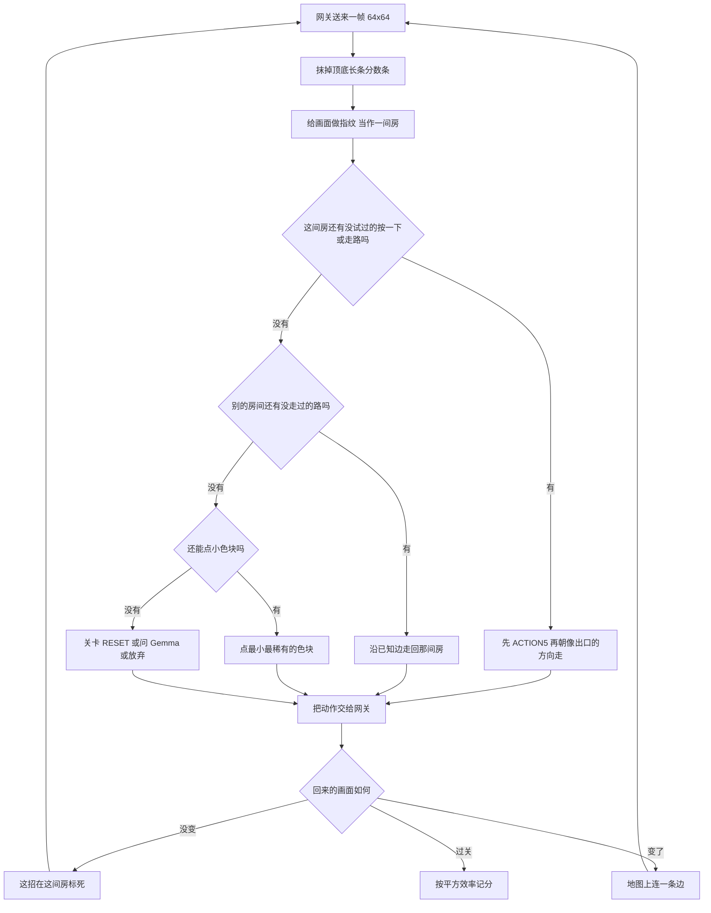

# 方案：我们怎么玩游戏

调研见 [SURVEY.md](SURVEY.md)。

比赛不给说明书。网关每次给你一张 64×64 画面，你还一个动作。
关卡分是平方效率：

```
level_score = min(1.15, (人步数 / AI步数) ^ 2)
```

人 10 步你 100 步只剩 0.01。所以要少走冤枉路，不是「能通就行」。

## 一句话

把每个画面当成地图上的一间房。进门先试「按一下」，再走路，最后才点。
试过没反应的招作废。迷路了沿原路回去。地图穷了才问 Gemma。

## 每一步



走路关：新格子先 ACTION5，认出角色后软偏向旗子，只走没踩过的格子。
点击关：走路全标死后，点小而稀有的色块。
Gemma 只在图穷了才问。不按游戏名写死。

Save and Run All 不打游戏。真打要点 Submit to Competition。
